# Emoji Memory Card Game

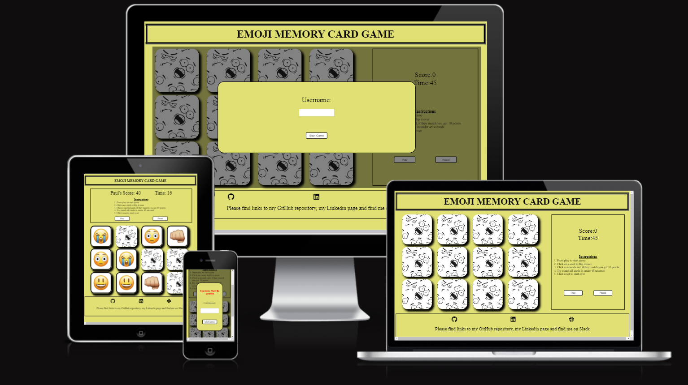

# Introduction
Memory Card Game is a classic memory-testing game where players must match pairs of cards with identical images. This project implements a simple version of the game using HTML, CSS, and JavaScript.
Try match the Emoji's before your time runs out! Can you do it in under 45 seconds? 

Link to [live site](https://hughes84.github.io/emoji-memory-card-game/)

# Table of Contents

- [How to Play](#how-to-play)
- [Technologies Used](#technologies-used)
- [Project Structure](#project-structure)
- [Dependencies](#dependencies)
- [Author](#author)
- [Design](#design)
    - [Wireframes](#wireframes)
- [Features](#features)
    - [Existing Features](#existing-features)
- [User Experience](#User-Experience)
    - [Site Goals](#site-goals)
- [Testing](#testing)
    - [Validator Testing](#validator-testing)
- [Accessibility](#accessibility)
    - [Developer Tools](#developer-tools)
- [Browser Testing](#browser-testing)
    - [Testing Environment](#testing-environment)
- [Manual Testing](#manual-testing)
- [User Interface](#user-interface)
    - [Card Appearance](#card-appearance)
    - [Game Instructions](#game-instructions)
- [Error Handling](#error-handling)
    - [Error Messages](#error-messages)
    - [Console Errors](#console-errors)
- [Testing User Stories](#testing-user-stories)
- [Bugs](#bugs)
- [Deployment](#deployment)
- [Credits](#credits)
- [Acknowledgments](#acknowledgments)

# How to Play

- Enter username.
- Click start game button.
- Press play button on game page.
- Click on a card to reveal an emoji image.
- Click on a second card to try and match the image.
- If the two cards match, they will remain face-up.
- If they do not match, both cards will be turned face-down again.
- Continue until all cards are matched or the time runs out.

[Back to Table of Contents](#table-of-contents)

# Technologies Used

1. HTML
2. CSS
3. JavaScript

# Project Structure

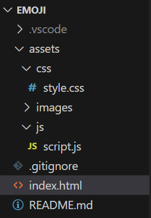

# Dependencies

This project does not have any external dependencies. It can be played in any modern web browser.

[Back to Table of Contents](#table-of-contents)

# Author

- Paul Hughes
- GitHub: hughes84

# Design

I designed my memory card game with the aim to deliver a familiar, simple experience for the target user. The game itself is a classic popular game which I predict all users will know the rules on how to play. The game is simple and easy to play even if the user has not come across such a game before. The countdown timer gives the game an extra thrill as the clock ticks down. I'm sure this will excite the user. I used emoji images which are used by nearly everyone on a daily basis. I believe this will give the user some familiarity.

## Wireframes

I invisaged my game to be easy to use and allow the user to get playing quickly. 

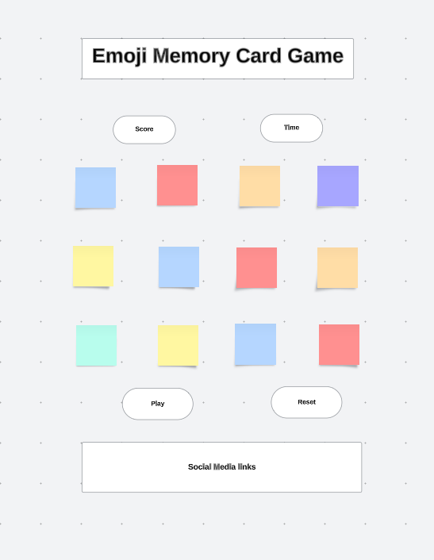
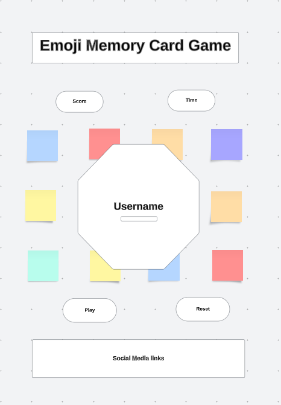
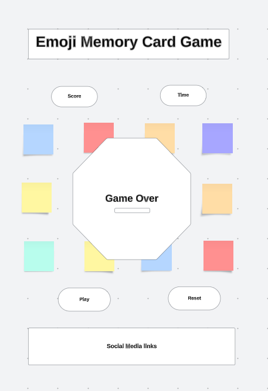

[Back to Table of Contents](#table-of-contents)

# Features

## Existing Features

- Header with game name.

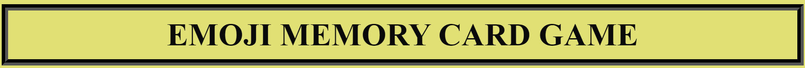

- Username dialog modal with start game button.

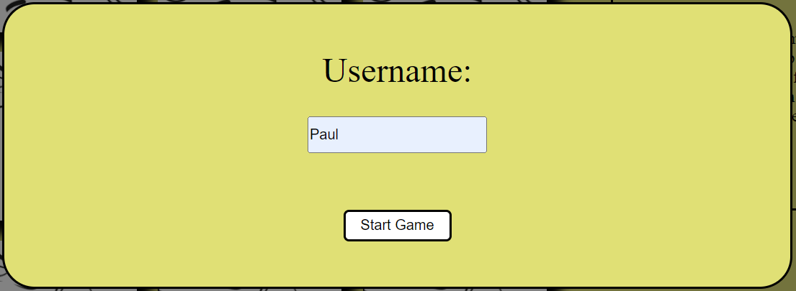

- Username error warning must be less than 10 characters.

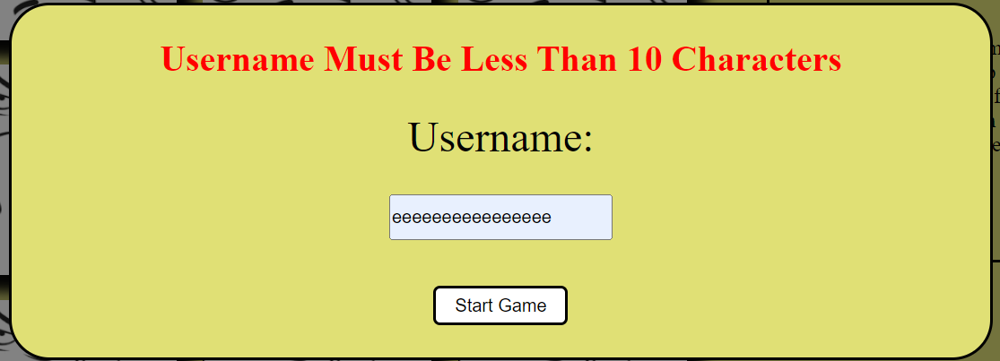

- Username error username must be entered.

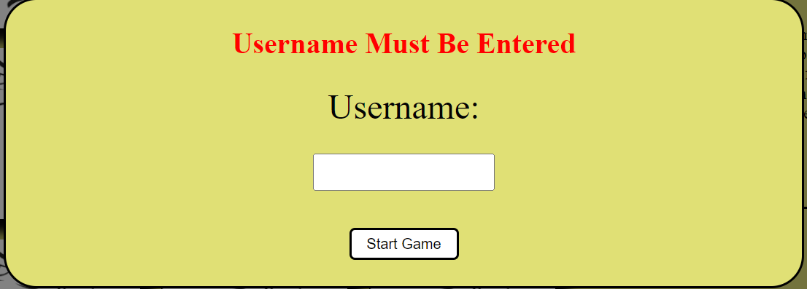

- A grid of 12 facedown cards that players can click on to reveal Emoji images.

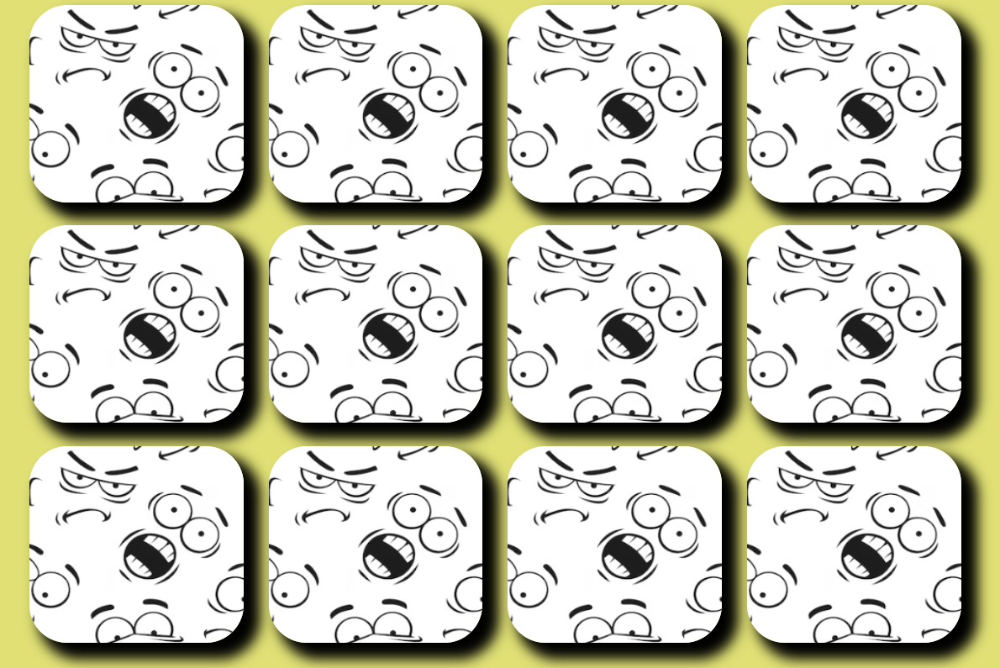
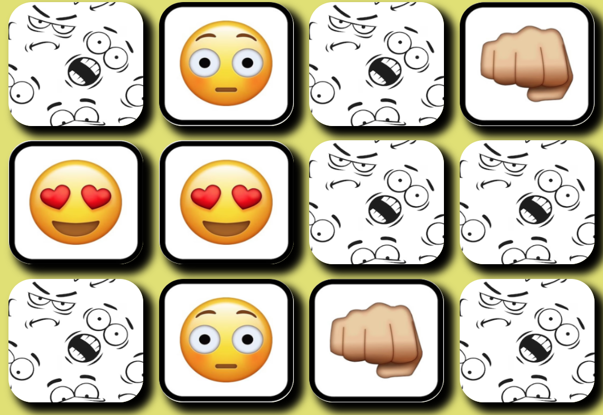

- Game area with instructions, score counter, timer and play and reset buttons.

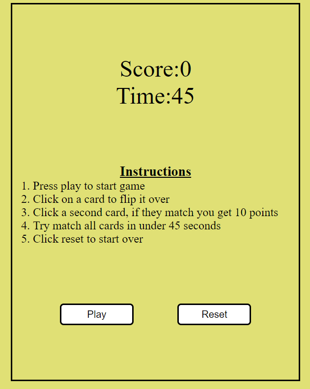

- A well done message when all pairs are successfully matched.

- A better luck next time message when time runs out.

- GitHub, Linkedn and Slack links.

.png)

[Back to Table of Contents](#table-of-contents)

# User Experience

## Site Goals

- The goal of the site is to provide the user with a simple yet fun memory game with the added entertainment of the every day used emojis.
- The game is quick at 45 seconds long which gives the user a thrill in trying to beat the clock.

[Back to Table of Contents](#table-of-contents)

# Testing

## Validator Testing

- HTML ([W3C validator](https://validator.w3.org/))

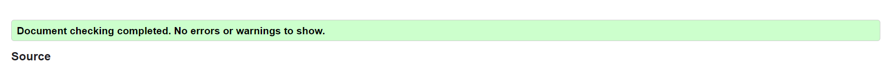

> Element link is missing one or more of the following attributes: rel.
> Info: Trailing slash on void elements has no effect and interacts badly with unquoted attribute values.
> Error: Element h3 not allowed as child of element u in this context.
> Error: Duplicate attribute rel.

[Back to Table of Contents](#table-of-contents)

- CSS [Jigsaw](https://jigsaw.w3.org/css-validator/)

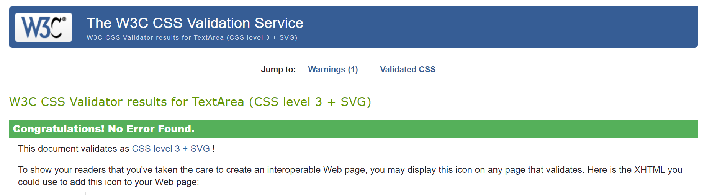

> There were no errors found in my CSS.

- JavaScript [JSHint](https://jshint.com/)

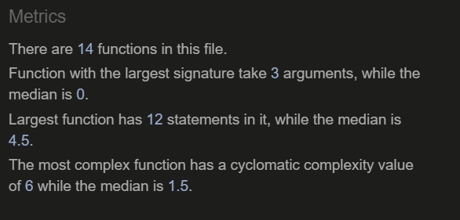

> Some semi-colons missing.

[Back to Table of Contents](#table-of-contents)

# Accessibility

## Developer Tools

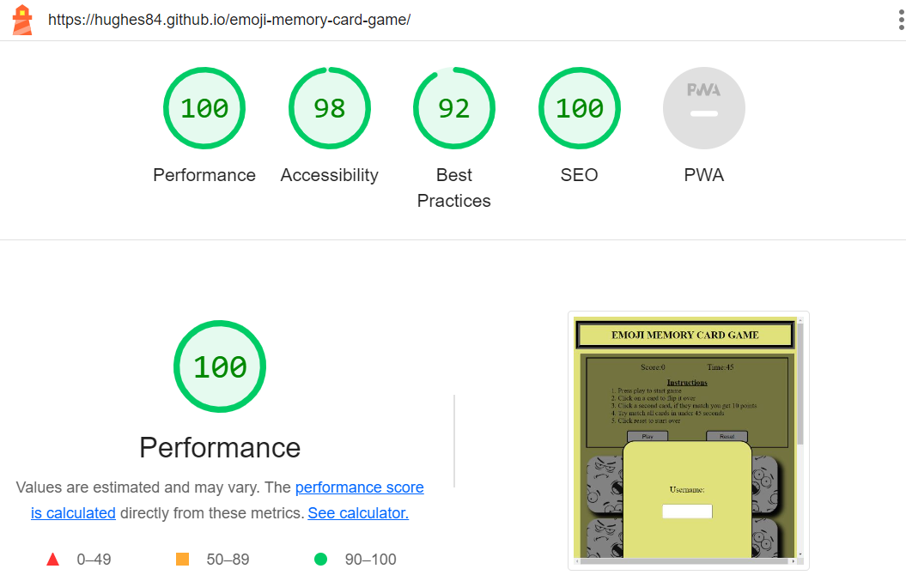

# Browser Testing

## Testing Environment

- Browser Compatibility: I tested my game on various web browsers such as Chrome, Firefox, Safari, and Edge to ensure cross-browser compatibility.
- Screen Sizes: I continuously tested my game on different screen sizes, including desktop and mobile, to ensure responsiveness.

[Back to Table of Contents](#table-of-contents)

**Functionality** 

- Tested performance of the game throughout. This included:
    - User dialog function. Input of player name and start game button. Player name must be under 10 characters
    - Game function 
    - Timer
    - Score

# Manual Testing

| Feature     | Expect      | Action        | Result |
| :---------: | :----------:| :-----------: | :-----:|
| **User name input**   | After entering  username, the name will appear beside the score when the user makes a match in the game  | Enter username and click "Start Game" button | Press play in game-area and click on card, click a second card. When a match is made username and user score appear |
| **Username input where input value is null**   | When a username is not entered a warning message will appear to prompt user to enter one   | Enter no username and click "Start Game" button | Game will not start |
| **Username input more than 10 characters**   | When a username of over 10 characters is entered a warning message will appear to prompt user of this   | Enter a username of over 10 characters and click "Start Game" button | Game will not start |
| **Start Game Button**  | When correct values entered and start game button clicked, the username dialog will close and the user will be brought to the game area  | Clicked Start Game button | Username dialog closes, user is brought to game area |
| **Footer links** | When clicked, links to the my Github repository, my Linkedn and slack open in a new tab |  Click on link | Relevant page opens in new tab |
| **Card flip** | When card is clicked, card flips over and shows emoji image | Click card | Card flips and shows emoji image |
| **Card match** | When a matching pair is made cards remain face up | Click cards until a matching pair of cards is found | Matching pair of cards remain face up |
| **Card no-match** | If turned cards do not match, cards will flip back over after 1 second | Click on cards with no match | After 1 second, cards flip back over |
| **Timer** | Timer will start running when play button clicked / finish running on game completion or when timer runs out | Click play / Complete game | Timer starts / Timer stops |
| **Score display** | User gets 10 points for each match with a maximum of 60 from 6 matches | Play game | Score displays with each match and on completion |
| **Game completion** | If all cards are matched congratulations message appears with user score/ If all cards are not matched better luck next time message appears | Complete game - finding all matching cards/ Complete game - not finding all matching cards | Congratulations message appears with user score/ Better luck next time message appears |
| **Reset button** | When clicked, game and timer will reset and current score to will go back to 0  | Click reset button | Game resets with timer and score going back to 0 |

## User Interface

### Card Appearance

- Ensure that all cards are displayed with appropriate images.
- Ensure that the cards appearance is consistent and alluring.

[Back to Table of Contents](#table-of-contents)

### Game Instructions

- Review the game's instructions.
- Ensure that the instructions are clear, correct and easy to understand.

## Error Handling

### Error Messages

- Purposely trigger errors by interacting with the game, for example click cards rapidly.
- Ensure that error messages are displayed clearly and colourful to show the user what went wrong.

### Console Errors

- Check the browser's developer console for any errors.
- Check for any errors in the console during game-play.

[Back to Table of Contents](#table-of-contents)

### Testing User Stories

| Expectation (As a user, I want to...)  | Result (As a user, I...)    |
| :---------------------------------: | :------------------------------:|
| be able to enter a username that then appears on the site | can enter a username at the start of the game and see it appears in the score area when I make a match |
| be able to navigate my way around the game quickly and with ease | am able to navigate my way around the site quickly and with ease |
| see some clear and precise instructions | can see some clear and precise instructions |
| be able to find links about the games structure and author | am able to find links about the games structure and author |
| see good contrasting colours that are visually appealing and relate to the theme | can see good contrasting colours that are visually appealing and relate to the theme |
| be able to play the game with simple quick clicks | am able to play the game with simple quick clicks |
| be able to watch the timer run down as I play | am able to watch the timer run down as I play |
| be able to see my score change as I match pairs and my total score at end of game | am able to see my score change as I match pairs and my total score at end of game |
| Be able to reset the game when I please | am able to reset the game by pressing the reset button |

[Back to Table of Contents](#table-of-contents)

# Bugs

| **Bug** | **Fix** |
| --- | --- |
| Bug: Play button not working correctly. When pressed more than once it was interferring with timer, speeding up coutdown | Solution: Removed eventlistner in startgame function|
| Bug: Warning sign in username dialog showing multiple warning signs| Solution: Add if statement to check if warning is already showing and if it is remove it|
| Bug: Cards truncating on smaller screens| Solution: Change grid in media query from four columns to three columns then to two|
| Bug: User could keep flipping more than two cards causing game to malfunction| Solution: Added boolean and set timeout function to stop player being able to turn over more than two at a time|

# Deployment

This site was created using the streamlined code editor Visual Studio Code and pushed to github to the repository ‘emoji’.

The following git commands were used during development to push code to the my repository:

- git add - To add files to the staging area before committing.

- git commit -m - To commit changes to the local repository.

- git push - To push all committed code to my repository on github.

[Back to Table of Contents](#table-of-contents)

# Credits

- Credit to W3 Schools for helping me resolve issues while coding throughout.
- The Love Maths project from Code Institute was a useful guide at times.
- Slack was also very helpful with peer assistance on occasion when stuck with a code.
- GitHub for storing the projects code.
- Color-hex.com for colors.
- Google fonts for fonts.
- Font Awesome for link symbols.
- W3C Markup Validation for helping validate my HTML code.
- W3C Jigsaw Validation for helping validate my CSS code.
- JSHint Validation for helping validate my JavaScript code.
- Am I responsive for helping check responsiveness of different sized screen sizes.
- Etsy for front of card emoji images.
- Freepik for back of card image.
- Wireframe Lucidchart for building wireframes. 
- Visual Studio Code for being my Integrated development environment.

# Acknowledgments

- This game was inspired by the classic and popular Memory Card Game.
- Built as a fun project for learning HTML, CSS, and JavaScript.

[Back to Table of Contents](#table-of-contents)