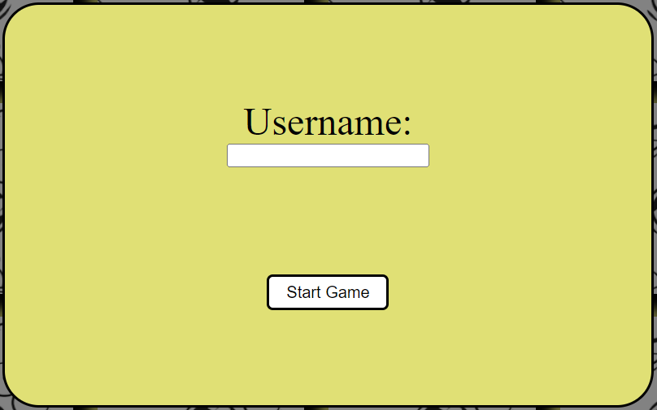
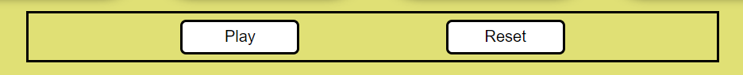
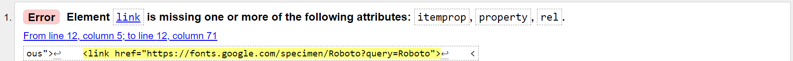
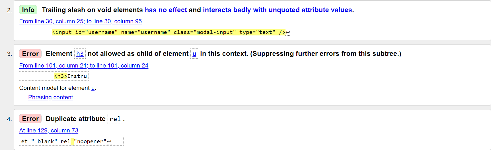

# Emoji Memory Card Game

# Introduction
Memory Card Game is a classic memory-testing game where players must match pairs of cards with identical images. This project implements a simple version of the game using HTML, CSS, and JavaScript.
Try match the Emoji's before your time runs out! Can you do it in under 45 seconds? 

Link to [live site](https://hughes84.github.io/emoji-memory-card-game/)

# Table of Contents

# How to Play

- Enter username.
- Click start game button.
- Press play button on game page.
- Click on a card to reveal an emoji image.
- Click on a second card to try and match the image.
- If the two cards match, they will remain face-up.
- If they do not match, both cards will be turned face-down again.
- Continue until all cards are matched or the time runs out.

[Back to Table of Contents](#table-of-contents)

# Technologies Used

1. HTML
2. CSS
3. JavaScript

# Project Structure

# Dependencies

This project does not have any external dependencies. It can be played in any modern web browser.

# Acknowledgments

- This game wass inspired by the classic and popular Memory Card Game.
- Built as a fun project for learning HTML, CSS, and JavaScript.

[Back to Table of Contents](#table-of-contents)

# Author

- Paul Hughes
- GitHub: hughes84

# Design

I designed my memory card game with the aim to deliver a familiar, simple experience for the target user. The game itself is a classic popular game which I predict all users will know the rules on how to play. The game is simple and easy to play even if the user has not come across such a game before. The countdown timer gives the game an extra thrill as the clock ticks down. I'm sure this will excite the user. I used emoji images which are used by nearly everyone on a daily basis. I believe this will give the user some familiarity.

## Wireframes

I invisaged my game to be easy to use and allow the user to get playing quickly. 

[Back to Table of Contents](#table-of-contents)

# Features

## Existing Features

- Header with game name.

- Username dialog modal with start game button.

- A grid of 12 facedown cards that players can click on to reveal Emoji images.

- A score counter and a timer to track progress.

- Play game button and option to reset the game.

- A well done message when all pairs are successfully matched.

- A better luck next time message when time runs out.

- GitHub, game rules and copyright links.

.png)

[Back to Table of Contents](#table-of-contents)

# User Experience

## Site Goals

- The goal of the site is to provide the user with a simple yet fun memory game with the added entertainment of the every day used emojis.
- The game is quick at 45 seconds long which gives the user a thrill in trying to beat the clock.

# User Stories

## As a first time user I want to

- be able to enter my own name into the field that then displays on the game page.
- be able to navigate my way around the site with ease.
- have good contrasting colours on display.
- have relevant links to information about the site.
- have access to rules of the game.
- be able to play the game quickly and easily.
- be able to see the timer I'm up against.
- be able to see my score.
- be able to reset the game at the click of a button.
- be able to find information on the site's author.

[Back to Table of Contents](#table-of-contents)

# Testing

## Validator Testing

- HTML ([W3C validator](https://validator.w3.org/))

- Element link is missing one or more of the following attributes: rel.

- Info: Trailing slash on void elements has no effect and interacts badly with unquoted attribute values.
- Error: Element h3 not allowed as child of element u in this context.
- Error: Duplicate attribute rel.

[Back to Table of Contents](#table-of-contents)

- CSS [Jigsaw](https://jigsaw.w3.org/css-validator/)

- There were no errors found in my CSS.

- JavaScript [JSHint](https://jshint.com/)

- Some semi-colons missing.

[Back to Table of Contents](#table-of-contents)

# Accessibility

## Developer Tools

# Browser Testing

## Testing Environment

- Browser Compatibility: I tested my game on various web browsers such as Chrome, Firefox, Safari, and Edge to ensure cross-browser compatibility.
- Screen Sizes: I continuously tested my game on different screen sizes, including desktop and mobile, to ensure responsiveness.

[Back to Table of Contents](#table-of-contents)

**Functionality** 

- Tested performance of the game throughout. This included:
    - User dialog function. Input of player name and start game button. Player name must be under 10 characters
    - Game function 
    - Timer
    - Score

# Manual Testing

<Launching game

- Verify that the game starts without errors or issues.
- Input username over 10 characters and press start game button - warning message appears.
- Input username under 10 characters and press start game button - game page opens.

<Game play

- Press play button - timer starts countdown.
- Press reset button - resets game.

<Card Matching

- Click on a card to flip it over.
- Click on another card to flip it over.
- Ensure that the game accurately identifies matching pairs.
- Ensure that unmatched pairs are flipped back over.

[Back to Table of Contents](#table-of-contents)

<Win/lose Condition

- Play the game until you have matched all pairs or until timer runs out.
- Ensure that a congratulations message appears upon winning.
- Ensure that a better luck next time message appears upon losing.

<Links

- Ensure links working appropriately and go to correct sites.

<Responsiveness

- Ensure responsiveness to all screen sizes from 1200px down to 320px.
- Ensure the game remains playable and is visually appealing on various screen sizes.

## User Interface

<Card Appearance

- Ensure that all cards are displayed with appropriate images.
- Ensure that the cards appearance is consistent and alluring.

[Back to Table of Contents](#table-of-contents)

<Game Instructions

- Review the game's instructions.
- Ensure that the instructions are clear, correct and easy to understand.

## Error Handling

<Error Messages

- Purposely trigger errors by interacting with the game, for example click cards rapidly.
- Ensure that error messages are displayed clearly and colourful to show the user what went wrong.

<Console Errors

- Check the browser's developer console for any errors.
- Check for any errors in the console during game-play.

[Back to Table of Contents](#table-of-contents)

# User Stories

1. **As a user**, I want to be able to start a new game from the beginning.

2. **As a user**, I want to see a timer clearly running while I play, so that I know when my time is running out.

3. **As a user**, I want to see a my score clearly so that I can see my progress.

4. **As a user**, I want the game to shuffle the cards differently everytime so the game is not repetitive.

5. **As a user**, I want to be able to click any card so it flips over revealing its image clearly.

6. **As a user**, I want to be able to flip two cards at a time trying to match them.

7. **As a user**, I want the game to check if my choice of cards match and they stay turned up if they do.

8. **As a user**, I want the game to turn the cards back over if they don't match.

9. **As a user**, I want the game to finish when I've matched all pairs correctly and display a congratulations message.

10. **As a user**, I want the option to reset the game whenever I choose so that I can start over.

11. **As a user**, I want the game to be able to learn the rules quickly, start playing quickly and have clear card images and a good colour contrast throughout.

13. **As a user on a smaller device**, I want to be able to play the game just as I would on a larger screen.

[Back to Table of Contents](#table-of-contents)

# Bugs

| **Bug** | **Fix** |
| --- | --- |
| Bug: Play button not working correctly. When pressed more than once it was interferring with timer, speeding up coutdown | Solution: |
| Bug: | Solution: |

# Deployment

This site was created using the streamlined code editor Visual Studio Code and pushed to github to the repository ‘emoji’.

The following git commands were used during development to push code to the my repository:

- git add - To add files to the staging area before committing.

- git commit -m - To commit changes to the local repository.

- git push - To push all committed code to my repository on github.